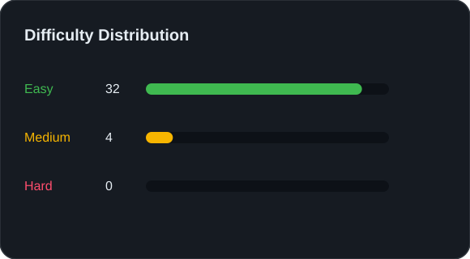
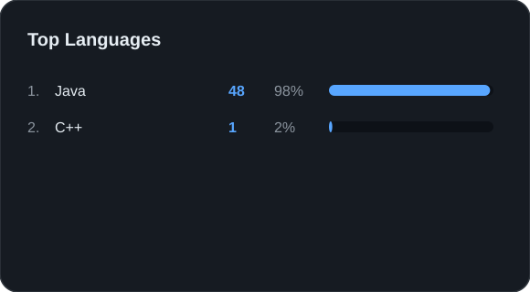
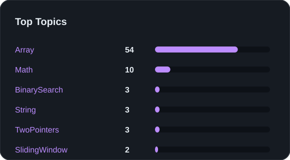
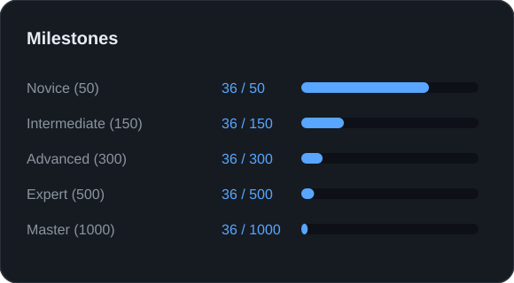
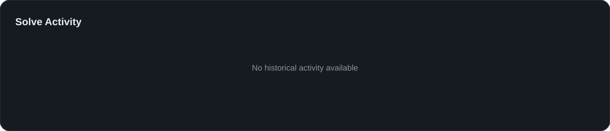
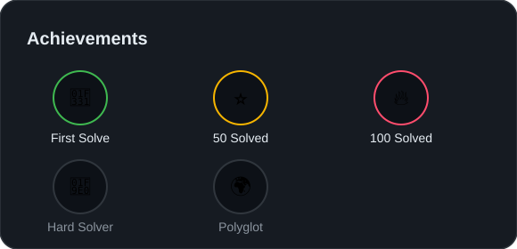
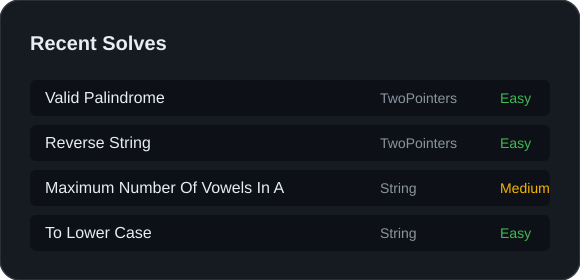

<p align="center">

# LeetCode Solutions


</p>

<p align="center">
  
  
</p>

<p align="center">
  
  
</p>

<p align="center">
  
</p>

<p align="center">
  
  
</p>

---

### 📝 Recently Solved Problems

| # | Problem | Topic | Difficulty | Languages |
|---|:--------|:------|:-----------|:----------|
| 1 | [Valid Palindrome](TwoPointers/Easy/valid-palindrome/) | TwoPointers | 🟢 Easy | Java |
| 2 | [Palindrome Number](Math/Easy/palindrome-number/) | Math | 🟢 Easy | Java |
| 3 | [Missing Number](Math/Easy/missing-number/) | Math | 🟢 Easy | Java |
| 4 | [Convert Integer To The Sum Of Two No Zero Integers](Math/Easy/convert-integer-to-the-sum-of-two-no-zero-integers/) | Math | 🟢 Easy | Java |
| 5 | [Search Insert Position](BinarySearch/Easy/search-insert-position/) | BinarySearch | 🟢 Easy | Java |
| 6 | [Binary Search](BinarySearch/Easy/binary-search/) | BinarySearch | 🟢 Easy | Java |
| 7 | [Two Sum](Array/Easy/two-sum/) | Array | 🟢 Easy | C++, Java |
| 8 | [Sum Of Unique Elements](Array/Easy/sum-of-unique-elements/) | Array | 🟢 Easy | Java |
| 9 | [Single Number](Array/Easy/single-number/) | Array | 🟢 Easy | Java |
| 10 | [Remove Duplicates From Sorted Array](Array/Easy/remove-duplicates-from-sorted-array/) | Array | 🟢 Easy | Java |

---

### 📁 Repository Structure

```
Topic/
  Difficulty/
    problem-slug/
      solution.ext     ← your accepted code
      README.md        ← AI-generated approach summary
      EXPLANATION.md   ← in-depth algorithmic explanation
```

---

<p align="center">
  <i>Auto Generated by <b>LeetCode → GitHub</b></i><br>
  <i>Generation Time: 2026-07-02 17:03:49</i>
</p>
